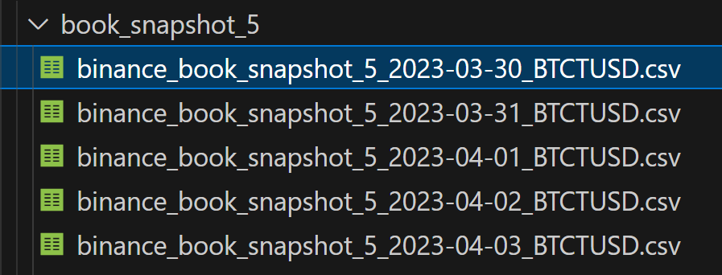

# Data Preparation for EarnHFT
This is the offical implementation about the data preparation for [the paper `EarnHFT`](https://arxiv.org/pdf/2309.12891.pdf).
## Environment Installation
Use command `conda create -n HFT_download python==3.7.15` to create the corresponding download environment.

Use command `conda activate HFT_download` to activate the corresponding download environment.

Use command `pip install -r requirements.txt` to install all the indepencies.

## Downloading Crypto Data

### Direct form Tardis API
We download the crypto spot data from [Tardis](https://tardis.dev/), which contain all sorts of formats. 

In this paper, we only need to download the [5-level orderbook snapshot](https://docs.tardis.dev/downloadable-csv-files#book_snapshot_5) and [trades](https://docs.tardis.dev/downloadable-csv-files#trades). We thoroughly explain how this data can be integrated into real trading senorita in the Appendix of the [paper](https://arxiv.org/pdf/2309.12891.pdf).

Use `bash download_code/download.sh` to download the data, you can explore different time periods or trading pair by manipulating `--symbols`, `--start_date`, and `--end_date`.

This code will automatically create a `download_from_tardis/XXX` folder in your workspace, where `XXX` represents the trading pair. The folder will contain 2 sub-folder:`book_snapshot_5` and `trades`, which contain files for each single day from `start_date` to `end_date`. 

### Download Result Demonstration

In case that most of the people do not have API key from [Tardis](https://tardis.dev/) or simply want to stick to their own data source but still want to utilize our preprocess tool, we further demonstrate the downloadin result.

After executing the `bash download_code/download.sh`, we will get a folder named `download_from_tardis`, as demonstrated here.

In total we download two kinds of data: orderbook snapshot with 5 levels and trades dataset. Each folder contain the downloaded result for each day, as demonstrated here.
| Orderbook Snaphot | Trade |
|------------|------------|
|  |  |

The downloaded files are csvs which look like these.
| Orderbook Snaphot | Trade |
|------------|------------|
|  |  |

They contain columns
| Orderbook Snaphot | Trade |
|------------|------------|
|  |  |

While other features are very easy to understand, the `timestamp` refers to the timestamp when the exchange sends out the message and `local_timestamp` refers to the timestamp when Tardis receives the message. 

You can get more demo data in gz format from this [link](https://docs.tardis.dev/downloadable-csv-files#data-types) provided by [Tardis](https://tardis.dev/).

## Preprocessing Crypto Data
There are three steps to preprocess the downloaded data to usable data which can be used in training EarnHFT.
### Concatenation and Cleanining
Run `bash preprocess/concat_clean.sh` to downsampling the `book_snapshot_5` and calculate the OHLCV based on the `trades`.

This command will first help concatenate all the files needed from `--start_date` to `--end_date` into a single file. We then generate 3 kinds of data under folder `preprocess/concat_clean/XXX/YYY-ZZZ`, where `XXX` is the trading pair, `YYY` is the start date and `ZZZ` is the end date.

The first file is `orderbook.feather`, it is pretty much like the original data in terms of data structure, with two main difference: 
- we downsamlpling the data into second level by choosing only the very first snapshot for every second, the original data's frequency is a bit unstable, from 10ms-100ms per snapshot.
- Even though there are normally tens of snapshot in one second, there is a chance that there is no snapshot in one second. Therefore, we fill in the blank result using the snapshot from the previous second.

The second file is `trade_second.feather`, it groups the trascation record every second and calculate the O,H,L,C for the price of first transcation in this second, the highest price of all transcation in this second,the lowest price of all transcation in this second, and the price of last transcation in this second. If no transcation has happened so far(it is nearly impossible recently since there are so many people trading crypto), we replace all the OHLC with the C from the last second.

The third file is `trade_minitue.feather`, it groups the trascation record every minute and calculate the O,H,L,C for the price of first transcation in this minute, the highest price of all transcation in this minute,the lowest price of all transcation in this minute, and the price of last transcation in this minute. If no transcation has happened so far(it is nearly impossible recently since there are so many people trading crypto), we replace all the OHLC with the C from the last minute.

Notice that when creating `trade_minitue.feather` and `trade_second.feather`, we need to put an extra minute/second on the timestamp to prevent any data leakage in the merging process.
### Creating Features
Run `bash preprocess/create_feature.sh` to create features as a prediction of the futrue price movement. This formulation could be dated back to [EIIE](https://arxiv.org/pdf/1706.10059.pdf), which is the first paper to apply RL to do quantitive trading. 

The features of orderbook are partially inspired by this [kaggle notebook](https://www.kaggle.com/code/ragnar123/optiver-realized-volatility-lgbm-baseline). Additionally, I have developed some features based on common time series operators.

The features of OHLC are partially inspired by [Alpha158](https://github.com/microsoft/qlib/blob/98f569eed2252cc7fad0c120cad44f6181c3acf6/qlib/contrib/data/handler.py#L142) from [qlib](https://github.com/microsoft/qlib/tree/main). Additionally, I have developed some features based on common time series operators.

### Merging Features

Run `bash preprocess/merge_new.sh` to allign the features using different data source(orderbook snapshot, OHLC-second, OHLC-minute) with the same timestamp.

It will create a `df.feather` which will be used in the 

### IC Analysis
Run `bash ic_analysis/calcualte_ic.sh` to calculate the correlation between the future price movement and the select proper features as the a part of the state(context described in this [paper](https://arxiv.org/pdf/2307.11685.pdf)). We create 2 sets of features:`ic_analysis/feature/minitue_feature.npy` and `ic_analysis/feature/second_feature.npy` as the input of high-level and low-level agents respectively. The selection critieria is based on the future price movement scale, where the low-level agents use the future one second price movement and the high-level agent uses the future one minute price movement.
